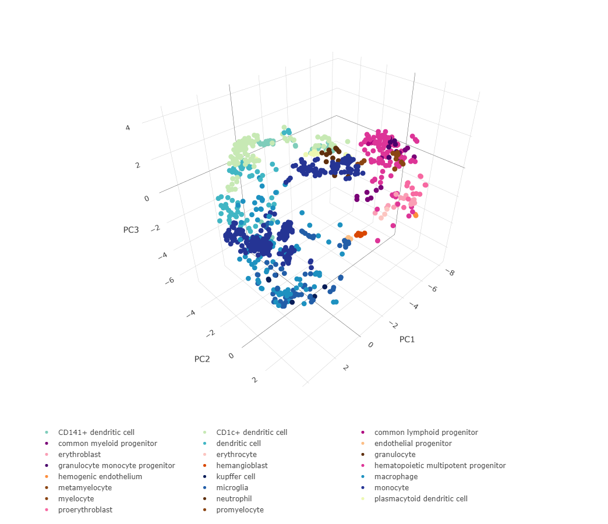

Introduction to Sincast\!
================
Yidi Deng,
JAN, 11th, 2021


## Query Bian etal.(2020) with Sincast

This is the very first Sincast version\! A R package will be release
soon\! Here I will give a very brief introduction to Sincast using the

1.  Query data from [Bian et
    al.(2020)](https://doi.org/10.1038/s41586-020-2316-7): **Deciphering
    human macrophage development at single-cell resolution.**

2.  Reference data from [Rajab et
    al.(2021)](https://doi.org/10.1016/j.stemcr.2021.04.010): \*\*An
    integrated analysis of human myeloid cells identifies gaps in in
    vitro models of in vivo biology

The query data can be downloaded at NCBI
[GSE133345](https://www.ncbi.nlm.nih.gov/geo/query/acc.cgi?acc=GSE133345),
and the reference data can be downloaded at the [Stemformatic data
protal](https://www.stemformatics.org/atlas/myeloid). They are also
available at our github page.

Now download [sincast
package.R](https://github.com/meiosis97/Sincast/blob/main/sincast%20package.R)
to get started\!

## Load functions

Put
[matMult.cpp](https://github.com/meiosis97/Sincast/blob/main/matMult.cpp)
into your R working directory and run

``` r
source('sincast package.R')
```

This will automatically download the required R packages (a propmt will
show up), and load Sincast functions into your global environment.

## Read your data

``` r
#load the query data
query.annotation <- read.table('GSE133345_Annotations_of_all_1231_embryonic_cells_updated_0620.txt')
query.data <- read.table('GSE133345_Quality_controled_UMI_data_of_all_1231_embryonic_cells.txt')
#load the reference data
reference.data <- read.table('RajabRankedExpressionMatrix.txt', check.names = F)
reference.annotation <- read.table('RajabSampleAnnotation.txt')
```

Check whether column names of data matches row names of annotation.

``` r
#Reference
all(colnames(reference.data) == rownames(reference.annotation))
```

    ## [1] TRUE

``` r
#Query
all(colnames(query.data) == rownames(query.annotation))
```

    ## [1] TRUE

Convert the query and the reference to **SingleCellExperiment (sce)**
Object.

``` r
reference <- createSce(data = reference.data, colData = reference.annotation) 
query <- createSce(counts = query.data, colData = query.annotation)
```

The reference data was [Rank
transformed](https://doi.org/10.1371/journal.pcbi.1008219) expression,
so we store it in the *data* slot. The query data is in raw counts so we
store it in the *counts* slot.

## Preprocess your data

First, normalize query library size.

``` r
query <- rcTransform(query)
```

Select cell type discriminant genes of the reference.

``` r
reference <- feature.weighting(reference, 'celltype')
```

Remove low quality genes and cells in the query. Then, filter both the
query and the reference data to the shared gene set between kept genes
of the query and cell type discriminant genes of the reference.

``` r
c(reference, query) %<-% filter.data(reference, query)
```

## Build the atlas

It’s time to build the atlas. Lets first customize the atlas color for
better visualization.

``` r
referenceColors <- c("#081d58","#225ea8","#1d91c0","#253494","#7fcdbb","#c7e9b4","#edf8b1","#41b6c4","#7a0177","#ae017e","#49006a","#dd3497","#5e2f0d","#5e2f0d","#8b4513","#8b4513","#8b4513","#fcc5c0","#fa9fb5","#f768a1","#fdbe85","#fd8d3c","#d94701")
names(referenceColors) <-  c("kupffer cell","microglia","macrophage","monocyte","CD141+ dendritic cell","CD1c+ dendritic cell","plasmacytoid dendritic cell","dendritic cell","common myeloid progenitor","common lymphoid progenitor","granulocyte monocyte progenitor","hematopoietic multipotent progenitor","neutrophil","granulocyte","myelocyte","metamyelocyte","promyelocyte","erythrocyte","erythroblast","proerythroblast","endothelial progenitor","hemogenic endothelium","hemangioblast")
```

Perform PCA on the reference to build the atlas.

``` r
reference <- make.atlas(reference = reference, col.by = 'celltype', colors = referenceColors,vis.atlas = T)
```



The interactive 3D plot can be reviewed at [interactive
3D plot](https://chart-studio.plotly.com/~meiosis/1/#plot)

## Impute the query data

Run Sincast imputation on the query. we plot here the diffusion
embedding learnt by eigen-decomposing the diffusion operator used for
Sincast data imputation. Cells in the embedding are connected by
weighted lines (edges) representing affinities. The Sincast diffusion
embedding gives a rough intuition on how the query cells are connected
and hence impute each other in the graph defined by Sincast.

``` r
query <- sincastImp(query, col.by = 'cluster')
```

    ## Now perform PCA

    ## Finish PCA

    ## Now construct affinity matrix

    ##   Calcualting distance

    ##   Scaling distance

    ##   Calculating band width

    ##   Laplacian normalization

    ## Finish construct affinity matrix

    ## Now impute

    ## Diffusing

    ## Scaling

    ## Finish impute

    ## Sparsity after imputation is 0


We then perform post-imputation data scaling to prevent over imputation.
Here, we show the log-gene mean and variance relationship representing
global gene dispersion trend in the imputed data. Dashed black line
represents generalized additive model fitting on the trend. Different
data showed similar trend, suggesting that there are consistent
dispersion trends to be estimated in scRNA-seq data. We scale the
imputed data according to their trend estimation.

``` r
query <- postScale(query)
```

    ## Genewise Mean and Variance estimation on imputed data

    ## Done

    ## Now perform GAM fit.

    ## Finish regress. k is 5

    ## Perform observation wise variance estimation

    ## Done


## Projection

Finally, we project the query on the reference and then visualize the
projection on the reference atlas.

``` r
query <- project(reference, query)
visProjection(reference, query, colReference.by = 'celltype', referenceColors = referenceColors, colQuery.by = 'cluster')
```


The interactive 3D plot can be reviewed at [interactive
3D plot](https://chart-studio.plotly.com/~meiosis/3/#plot)
