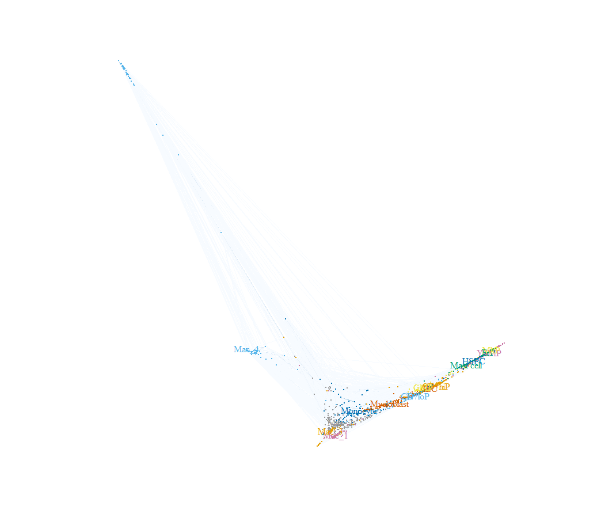
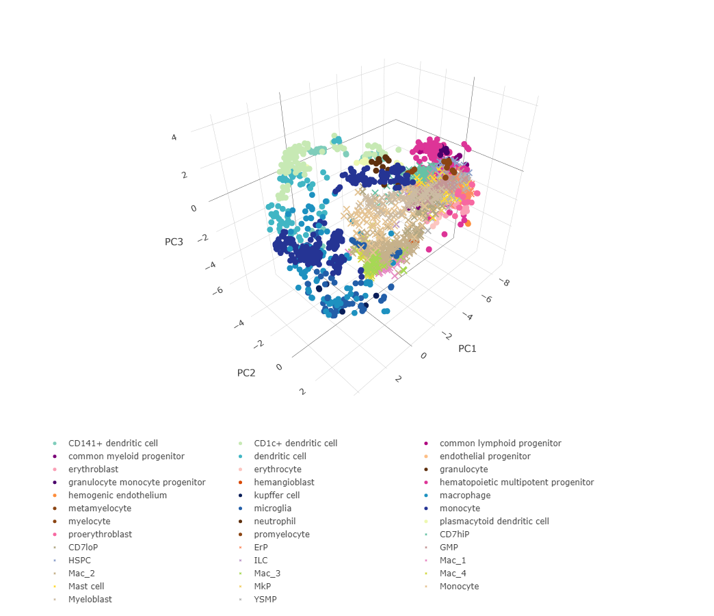

Introduction to Sincast\!
================
Yidi Deng,
NOV, 9th, 2021


## Query Bian etal.(2020) with Sincast

This is the very first Sincast version\! A R package will be release
soon\! Here I will give a very brief introduction to Sincast using the

1.  Query data from [Bian et
    al.(2020)](https://doi.org/10.1038/s41586-020-2316-7): **Deciphering
    human macrophage development at single-cell resolution.**

2.  Reference data from [Rajab et
    al.(2021)](https://doi.org/10.1016/j.stemcr.2021.04.010): **An
    integrated analysis of human myeloid cells identifies gaps in in
    vitro models of in vivo biology**

The query data can be downloaded at NCBI
[GSE133345](https://www.ncbi.nlm.nih.gov/geo/query/acc.cgi?acc=GSE133345),
and the reference data can be downloaded at the [Stemformatic data
protal](https://www.stemformatics.org/atlas/myeloid). They are also
available at our github page.

Now download [sincast
package.R](https://github.com/meiosis97/Sincast/blob/main/sincast%20package.R)
to get started\!

## Load functions

Put
[matMult.cpp](https://github.com/meiosis97/Sincast/blob/main/matMult.cpp)
into your R working directory and run

``` r
source('sincast package.R')
```

This will automatically download the required R packages (a propmt will
show up), and load Sincast functions into your global environment.

## Read your data

``` r
#load the query data
query.annotation <- read.table('GSE133345_Annotations_of_all_1231_embryonic_cells_updated_0620.txt')
query.data <- read.table('GSE133345_Quality_controled_UMI_data_of_all_1231_embryonic_cells.txt')
#load the reference data
reference.data <- read.table('RajabRankedExpressionMatrix.txt', check.names = F)
reference.annotation <- read.table('RajabSampleAnnotation.txt')
```

Check whether column names of data matches row names of annotation.

``` r
#Reference
all(colnames(reference.data) == rownames(reference.annotation))
```

    ## [1] TRUE

``` r
#Query
all(colnames(query.data) == rownames(query.annotation))
```

    ## [1] TRUE

Convert the query and the reference to **SingleCellExperiment (sce)**
Object.

``` r
reference <- createSce(data = reference.data, colData = reference.annotation) 
query <- createSce(counts = query.data, colData = query.annotation)
```

The reference data was [Rank
transformed](https://doi.org/10.1371/journal.pcbi.1008219) expression,
so we store it in the *data* slot. The query data is in raw counts so we
store it in the *counts* slot.

## Preprocess your data

First, normalize query library size.

``` r
query <- rcTransform(query)
```

Select cell type discriminant genes of the reference.

``` r
reference <- feature.weighting(reference, 'celltype')
```

Remove low quality genes and cells in the query. Then, filter both the
query and the reference data to the shared gene set between kept genes
of the query and cell type discriminant genes of the reference.

``` r
c(reference, query) %<-% filter.data(reference, query)
```

## Build the atlas

It’s time to build the atlas. Lets first customize the atlas color for
better visualization.

``` r
referenceColors <- c("#081d58","#225ea8","#1d91c0","#253494","#7fcdbb","#c7e9b4","#edf8b1","#41b6c4","#7a0177","#ae017e","#49006a","#dd3497","#5e2f0d","#5e2f0d","#8b4513","#8b4513","#8b4513","#fcc5c0","#fa9fb5","#f768a1","#fdbe85","#fd8d3c","#d94701")
names(referenceColors) <-  c("kupffer cell","microglia","macrophage","monocyte","CD141+ dendritic cell","CD1c+ dendritic cell","plasmacytoid dendritic cell","dendritic cell","common myeloid progenitor","common lymphoid progenitor","granulocyte monocyte progenitor","hematopoietic multipotent progenitor","neutrophil","granulocyte","myelocyte","metamyelocyte","promyelocyte","erythrocyte","erythroblast","proerythroblast","endothelial progenitor","hemogenic endothelium","hemangioblast")
```

Perform PCA on the reference to build the atlas.

``` r
reference <- make.atlas(reference = reference, col.by = 'celltype', colors = referenceColors,vis.atlas = T)
```


The interactive 3D plot can be reviewed at [interactive
3D plot](https://chart-studio.plotly.com/~meiosis/1/#plot)

## Impute the query data

Run Sincast imputation on the query. we plot here the diffusion
embedding learnt by eigen-decomposing the diffusion operator used for
Sincast data imputation. Cells in the embedding are connected by
weighted lines (edges) representing affinities. The Sincast diffusion
embedding gives a rough intuition on how the query cells are connected
and hence impute each other in the graph defined by Sincast.

``` r
query <- sincastImp(query, col.by = 'cluster')
```


We then perform post-imputation data scaling to prevent over imputation.
Here, we show the log-gene mean and variance relationship representing
global gene dispersion trend in the imputed data. Dashed black line
represents generalized additive model fitting on the trend. Different
data showed similar trend, suggesting that there are consistent
dispersion trends to be estimated in scRNA-seq data. We scale the
imputed data according to their trend estimation.

``` r
query <- postScale(query)
```


## Projection

We project the query on the reference and then visualize the
projection on the reference atlas. 

``` r
query <- project(reference, query)
visProjection(reference, query, colReference.by = 'celltype', referenceColors = referenceColors, colQuery.by = 'cluster')
```



The interactive 3D plot can be reviewed at [interactive
3D plot](https://chart-studio.plotly.com/~meiosis/3/#plot)

## Capybara prediction

We use improved [Capybara cell score](https://doi.org/10.1101/2020.02.17.947390) to predict query cell identity by referring to the reference data. We benchmark query cells against the reference *celltype* label, and weight the restricted linear regression in Capybara by the mean Helligner Distance to acount for varible power of genes in classifying cell types. 

``` r
query <- SincastCapybara(reference, query, clusterid = 'celltype', w = 'HD_mean')
```

We can super-impose Capybara cell scores on the query projection. Below we show query cells colored by their *macrophage* identities.

``` r
visProjection(reference, query, colReference.by = 'celltype', referenceColors = referenceColors, colQuery.by = 'Cb_macrophage')
```


The interactive 3D plot can be reviewed at [interactive
3D plot](https://chart-studio.plotly.com/~meiosis/5/#/)

## Reference
Bian Z, Gong Y, Huang T, Lee CZW, Bian L, Bai Z, Shi H, Zeng Y, Liu C, He J, Zhou J, Li X, Li Z, Ni Y, Ma C, Cui L, Zhang R, Chan JKY, Ng LG, Lan Y, Ginhoux F, Liu B. Deciphering human macrophage development at single-cell resolution. Nature. 2020 Jun;582(7813):571-576. doi: 10.1038/s41586-020-2316-7. Epub 2020 May 20. PMID: 32499656.

Rajab N, Angel PW, Deng Y, Gu J, Jameson V, Kurowska-Stolarska M, Milling S, Pacheco CM, Rutar M, Laslett AL, Lê Cao KA, Choi J, Wells CA. An integrated analysis of human myeloid cells identifies gaps in in vitro models of in vivo biology. Stem Cell Reports. 2021 Jun 8;16(6):1629-1643. doi: 10.1016/j.stemcr.2021.04.010. Epub 2021 May 13. PMID: 33989517; PMCID: PMC8190595.

Angel PW, Rajab N, Deng Y, Pacheco CM, Chen T, Lê Cao KA, Choi J, Wells CA. A simple, scalable approach to building a cross-platform transcriptome atlas. PLoS Comput Biol. 2020 Sep 28;16(9):e1008219. doi: 10.1371/journal.pcbi.1008219. PMID: 32986694; PMCID: PMC7544119.

Yidi Deng, Jarny Choi, Kim-Anh Le Cao. Sincast: a computational framework to predict cell identities in single cell transcriptomes using bulk atlases as references. bioRxiv 2021.11.07.467660; doi: https://doi.org/10.1101/2021.11.07.467660
