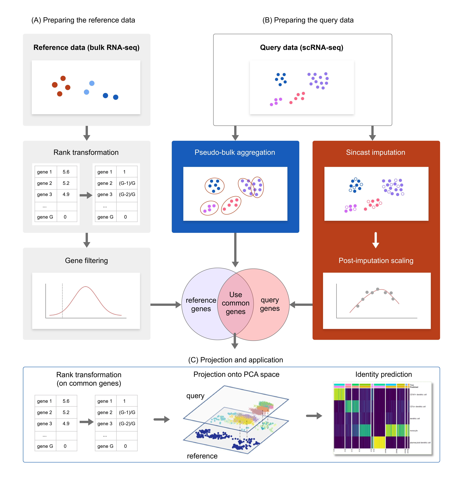
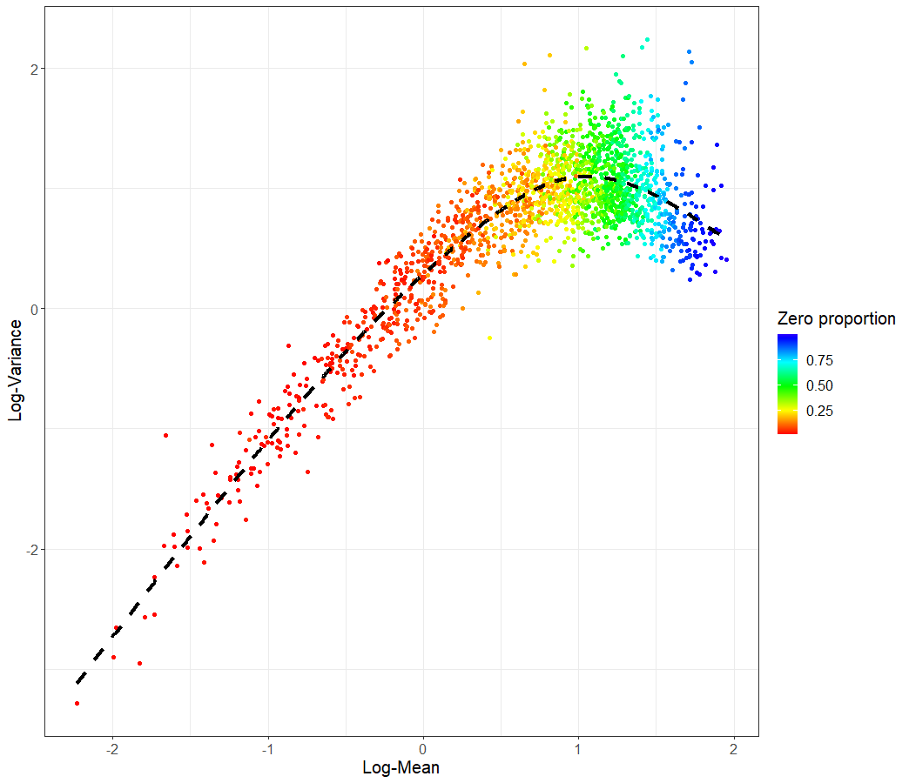
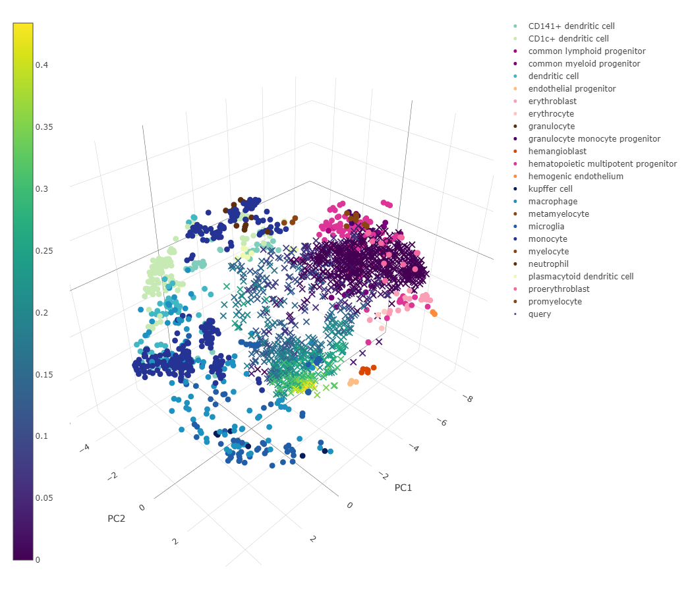
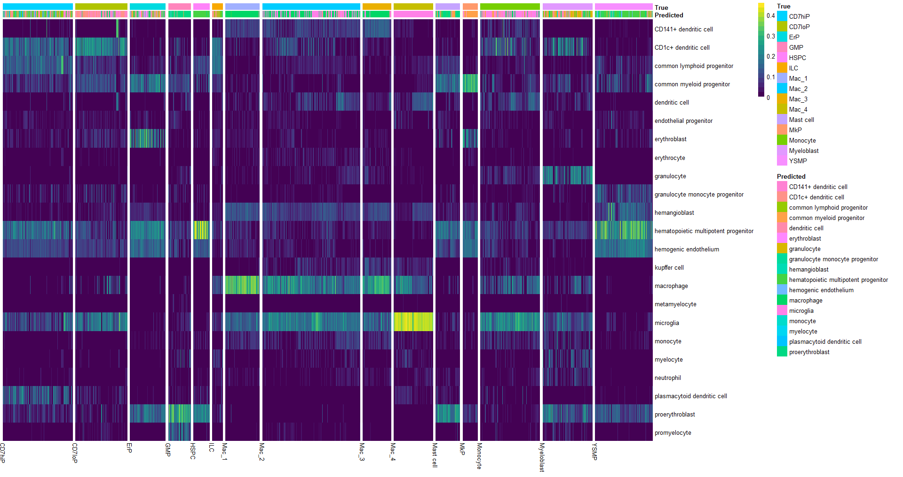
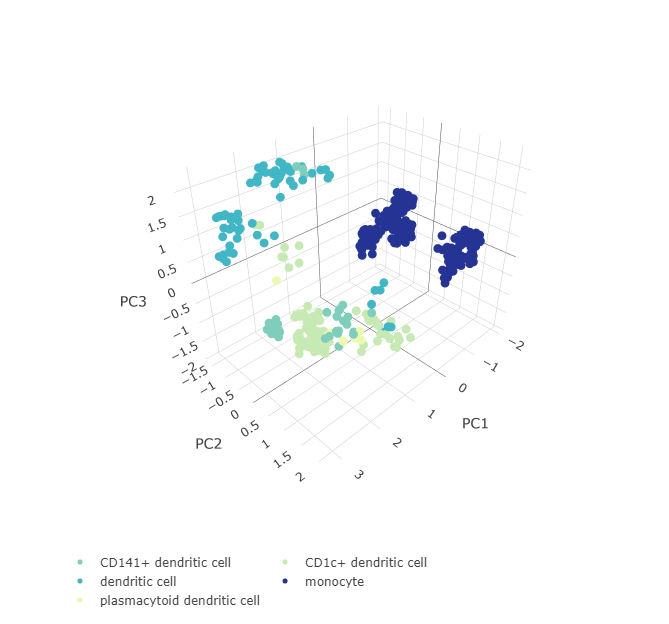
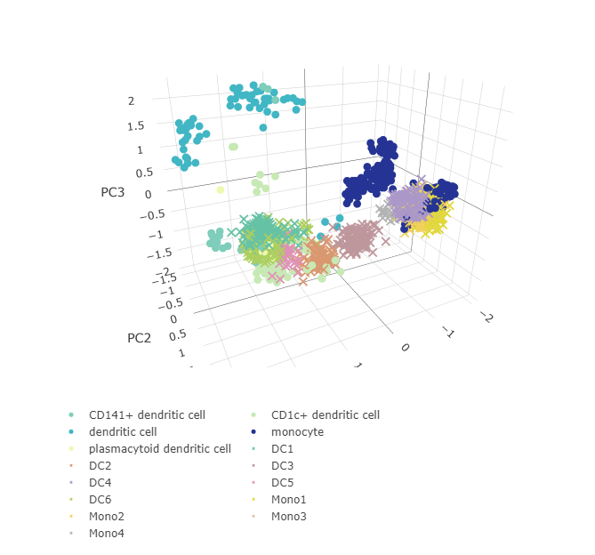
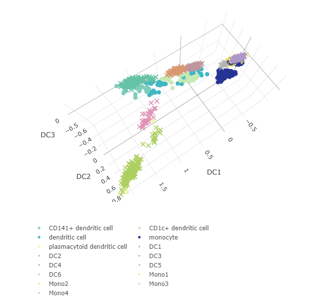

# Introduction to Sincast\!

Yidi Deng,
NOV, 9th, 2021


# What is Sincast?
Sincast ([Deng et al. (2021)](https://doi.org/10.1101/2021.11.07.467660)) is a computational framework to query scRNA-seq data (SIN) by **projecting onto bulk reference atlases** (CAST). Prior to projection, single cell data are transformed to be directly comparable to bulk data, either with pseudo-bulk aggregation or graph-based imputation to address sparse single cell expression profiles. Sincast avoids batch effect correction, and cell identity is predicted along a continuum to highlight new cell states not found in the reference atlas.




# Query Bian etal.(2020) with Sincast

This is the very first Sincast version\! Here I will give a very brief introduction to Sincast using the

1.  Query data from [Bian et
    al.(2020)](https://doi.org/10.1038/s41586-020-2316-7): **Deciphering
    human macrophage development at single-cell resolution.**

2.  Reference data from [Rajab et
    al.(2021)](https://doi.org/10.1016/j.stemcr.2021.04.010): **An
    integrated analysis of human myeloid cells identifies gaps in in
    vitro models of in vivo biology**

The query data can be downloaded at NCBI
[GSE133345](https://www.ncbi.nlm.nih.gov/geo/query/acc.cgi?acc=GSE133345),
and the reference data can be downloaded at the [Stemformatic data
protal](https://www.stemformatics.org/atlas/myeloid). They are also
available at our github page.

Now download Sincast package to get started!

## Install functions

Make sure that you have the latest version of devetools and run 

``` r
devtools::install_github('meiosis97/Sincast@main',subdir = 'pkg')
```

This will automatically download the required R packages (a propmt will
show up)

Now load Sincast functions into your global environment.

``` r
library(Sincast)
```

## Read your data

``` r
#load the query data
query.annotation <- read.table('GSE133345_Annotations_of_all_1231_embryonic_cells_updated_0620.txt')
query.data <- read.table('GSE133345_Quality_controled_UMI_data_of_all_1231_embryonic_cells.txt')
#load the reference data
reference.data <- read.table('RajabRankedExpressionMatrix.txt', check.names = F)
reference.annotation <- read.table('RajabSampleAnnotation.txt')
```

Both the data matrix and the metadata matrix must be named. The data matrix is gene by cell, and the metadata matrix is cell by variable. Hence we need to first check that column names of data match row names of annotations.

``` r
#Reference
all(colnames(reference.data) == rownames(reference.annotation))
```

    ## [1] TRUE

``` r
#Query
all(colnames(query.data) == rownames(query.annotation))
```

    ## [1] TRUE

Convert the query and the reference to **SingleCellExperiment (sce)**
Object. 

``` r
reference <- createSce(data = reference.data, colData = reference.annotation, as.sparse = FALSE) 
query <- createSce(counts = query.data, colData = query.annotation)
```

The reference data was [Rank
transformed](https://doi.org/10.1371/journal.pcbi.1008219) expression,
so we store it in the *data* slot of the sce. Becasue reference bulk data is not sparse, we don't store the data as a sprase matrix to reduce memory usage. 
The query data is in raw counts so we
store it in the *counts* slot. We specify data annotation by the *colData* argument.

## Preprocess your data

First, normalize query library size.

``` r
query <- rcTransform(query)
```

Select cell type discriminant genes of the reference. By setting *clusterid* to *celltype*, we tell the algorithm to select genes that are discriminant agasint the atlas annotation *celltype*, which is stored in the *ColData* of the reference (so *celltype* is a variable name in the reference annotation matrix).

``` r
reference <- featureWeighting(reference, clusterid = 'celltype')
```

Remove low quality genes and cells in the query. Then, filter both the
query and the reference data to the shared gene set between kept genes
of the query and cell type discriminant genes of the reference.

``` r
c(reference, query) %<-% filterData(reference, query)
```

## Build the atlas

It’s time to build a atlas, which is the PCA representation of the reference data. Lets first customize the atlas color for
better visualization.

``` r
referenceColors <- c("#081d58","#225ea8","#1d91c0","#253494","#7fcdbb","#c7e9b4","#edf8b1","#41b6c4","#7a0177","#ae017e","#49006a","#dd3497","#5e2f0d","#5e2f0d","#8b4513","#8b4513","#8b4513","#fcc5c0","#fa9fb5","#f768a1","#fdbe85","#fd8d3c","#d94701")
names(referenceColors) <-  c("kupffer cell","microglia","macrophage","monocyte","CD141+ dendritic cell","CD1c+ dendritic cell","plasmacytoid dendritic cell","dendritic cell","common myeloid progenitor","common lymphoid progenitor","granulocyte monocyte progenitor","hematopoietic multipotent progenitor","neutrophil","granulocyte","myelocyte","metamyelocyte","promyelocyte","erythrocyte","erythroblast","proerythroblast","endothelial progenitor","hemogenic endothelium","hemangioblast")
```

Perform PCA on the reference to build the atlas.

``` r
reference <- makeAtlas(reference = reference, col.by = 'celltype', colors = referenceColors,vis.atlas = T)
```


The interactive 3D plot can be reviewed at [interactive
3D plot](https://chart-studio.plotly.com/~meiosis/1/#plot)

## Impute the query data

Run Sincast imputation on the query. we plot here the diffusion
embedding learnt by eigen-decomposing the diffusion operator used for
Sincast data imputation. Cells in the embedding are connected by
weighted lines (edges) representing affinities. The Sincast diffusion
embedding gives a rough intuition on how the query cells are connected
and hence impute each other in the graph defined by Sincast. We use
*col.by* to indicate that query cells should be colored by their cluster
annotation.

``` r
query <- sincastImp(query, col.by = 'cluster')
```


We then perform post-imputation data scaling to prevent over imputation.
Here, we show the log-gene mean and variance relationship representing
global gene dispersion trend in the imputed data. Dashed black line
represents generalized additive model fitting on the trend. Different
data showed similar trend, suggesting that there are consistent
dispersion trends to be estimated in scRNA-seq data. We scale the
imputed data according to their trend estimation.

``` r
query <- postScale(query)
```



## Projection

We project the query on the atlas and then visualize the
projection. *colReference.by* and *colQuery.by*  specify variables in the annotation
that color samples/cells. *referenceColors* sets the reference color scheme.

``` r
query <- project(reference, query)
visProjection(reference, query, colReference.by = 'celltype', referenceColors = referenceColors, colQuery.by = 'cluster')
```


The interactive 3D plot can be reviewed at [interactive
3D plot](https://chart-studio.plotly.com/~meiosis/3/#plot)

## Capybara prediction

We use improved [Capybara cell score](https://doi.org/10.1101/2020.02.17.947390) to predict query cell identity by referring to the reference data. We benchmark query cells against the reference *celltype* label, and weight the restricted linear regression in Capybara by the mean *Helligner Distance* to acount for varible power of genes in classifying cell types. The *HD_mean* variable in the reference annotation is generated before when we ran the *feature.weighting* function.

``` r
query <- SincastCapybara(reference, query, clusterid = 'celltype', w = 'HD_mean')
```

We can then super-impose continouse vraiable on the query projection, such as gene exxpression and Capybara cell scores. Below we show query cells colored by their *macrophage* identities.

``` r
visProjection(reference, query, colReference.by = 'celltype', referenceColors = referenceColors, colQuery.by = 'Cb_macrophage')
```



The interactive 3D plot can be reviewed at [interactive
3D plot](https://chart-studio.plotly.com/~meiosis/5/#/)

Or, we can use heatmap to visualize Capybara cell score predicted on each query cell. Row labels are reference cell types, and each column in the heatmap represents a query cell. The original cell type labels, *cluster*, from the query were annotated to column.

``` r
CapybaraHeatmap(query)
```




# Query Villani etal.(2017) with Sincast

Now lets see how cell aggregation works. To demonstrate, we use 

1.  Query data from [Vinalli et
    al.(2017)](https://doi/10.1126/science.aah4573): **Single-cell RNA-seq reveals new types of
    human blood dendritic cells, monocytes, and progenitors**

2.  Monocyte and Dendritic cell subset of reference data from [Rajab et
    al.(2021)](https://doi.org/10.1016/j.stemcr.2021.04.010): **An
    integrated analysis of human myeloid cells identifies gaps in in
    vitro models of in vivo biology**

The query data can be downloaded at [the Broad Institue Single Cell Data Protal](https://singlecell.broadinstitute.org/single_cell/study/SCP43/atlas-of-human-blood-dendritic-cells-and-monocytes),
and the reference data can be downloaded at the [Stemformatic data
protal](https://www.stemformatics.org/atlas/myeloid). They are also
available at our github page.

## Read your data

Similar as above, we should also read the Villani query data and meta data, and check whether their dimnames match.

``` r
#load the query data
query.annotation <- read.table('metadata.txt')
query.data <- read.table('tpm_expression_matrix.txt')
all(colnames(query.data) == rownames(query.annotation))
```


    ## [1] TRUE


Convert the query data to SingleCellExperiment (sce) Object. We don't show reference data loading here because it's done exactly the same as before.

``` r
query <- createSce(counts = query.data, colData = query.annotation)
```

## Subset the reference data to Monocyte and DC subsets.

This can be done in the same way as the common data frame subsetting in R.

``` r
reference <- reference[,reference$celltype%in%c('monocyte', 'CD141+ dendritic cell', 'CD1c+ dendritic cell',
                                   'plasmacytoid dendritic cell', 'dendritic cell')]
```

and for reference color

``` r
referenceColors <- c("#081d58","#225ea8","#1d91c0","#253494","#7fcdbb","#c7e9b4","#edf8b1","#41b6c4","#7a0177","#ae017e","#49006a","#dd3497","#5e2f0d","#5e2f0d","#8b4513","#8b4513","#8b4513","#fcc5c0","#fa9fb5","#f768a1","#fdbe85","#fd8d3c","#d94701")
names(referenceColors) <-  c("kupffer cell","microglia","macrophage","monocyte","CD141+ dendritic cell","CD1c+ dendritic cell","plasmacytoid dendritic cell","dendritic cell","common myeloid progenitor","common lymphoid progenitor","granulocyte monocyte progenitor","hematopoietic multipotent progenitor","neutrophil","granulocyte","myelocyte","metamyelocyte","promyelocyte","erythrocyte","erythroblast","proerythroblast","endothelial progenitor","hemogenic endothelium","hemangioblast")
referenceColors <- referenceColors[c('monocyte', 'CD141+ dendritic cell', 'CD1c+ dendritic cell', 'plasmacytoid dendritic cell', 'dendritic cell')]
```

Now we are ready for Sincast!

## Subset the reference data to Monocyte and DC subsets and build atlas.

The procedure is the same as before. So we don't explain it again here.

``` r
reference <- featureWeighting(reference, clusterid = 'celltype',assay2rank = 'data')
c(reference, query) %<-% filterData(reference, query)
reference <- makeAtlas(reference = reference, col.by = 'celltype', colors = referenceColors, vis.atlas = T)
```



The interactive 3D plot can be reviewed at [interactive
3D plot](https://chart-studio.plotly.com/~meiosis/7/#/)

## Aggretation

We sample cells with replacement within each query cluster (specified by the metadata attribute *celltype*). Pseudo-bulk samples are generated by taking the averages between sampled cells. Here, we set the sampling size to 15, so each pseudo-bulk sample is generated by aggregating 15 cells. This sampling-averaging procedure can be repeated for several times to generate bootstraped sampling distribution of averaged expression profile of each query cluster. We store pseudo-bulk samples in a sperated sce object.

``` r
Aggquery <- aggregate(query, assay = 'data', clusterid = 'celltype', nPool = 15)
```

## Projection

Projection need to be modfied a bit. Here we need to tell the function that we are projecting query data in the *data* slot of the query sce, as the aggregated expression profiles were stored in the *data* slot. 

``` r
Aggquery <- project(reference, Aggquery, assay = 'data')
```

## Visualization and Diffusion Reconstruction

We viasualize the query projection, but found that **DC1**, **DC5** and **DC6**, which are known to be CD141+DC, AS-DC and pDC respectively, can hardly be distinguished on the atlas PCA. The PCA does not give us good indication on the phenotype of these three cluters.

``` r
visProjection(reference, Aggquery, colReference.by = 'celltype', referenceColors = colors, colQuery.by = 'celltype')
```



The interactive 3D plot can be reviewed at [interactive
3D plot](https://chart-studio.plotly.com/~meiosis/9/#/)

However, we can apply diffusion map to the projection for a better visualization of the reference-query
relationship. The data coordinates learnt from the atlas PCA were non-linearly reconstructed
by this second embedding to form new coordinates called diffusion component. After diffusion map,
 **DC1**, **DC5** and **DC6** clusters were clearly separated on the diffusion components. 
According to Villani etal, DC5 (AS-DC) is a DC subtype with
transitional identity altering between DC6 (pDC) and DC2,3 (CD1c+ DC). DC5’s transitional
identity was wellly captured by the atlas, which shows a clear pDC-cDC trajectory on the diffusion
components.

``` r
DiffusionReconstruct(reference, Aggquery,  colReference.by = 'celltype', referenceColors = colors, colQuery.by = 'celltype')
```



The interactive 3D plot can be reviewed at [interactive
3D plot](https://chart-studio.plotly.com/~meiosis/11/#/)


## Reference
Bian Z, Gong Y, Huang T, Lee CZW, Bian L, Bai Z, Shi H, Zeng Y, Liu C, He J, Zhou J, Li X, Li Z, Ni Y, Ma C, Cui L, Zhang R, Chan JKY, Ng LG, Lan Y, Ginhoux F, Liu B. Deciphering human macrophage development at single-cell resolution. Nature. 2020 Jun;582(7813):571-576. doi: 10.1038/s41586-020-2316-7. Epub 2020 May 20. PMID: 32499656.

Rajab N, Angel PW, Deng Y, Gu J, Jameson V, Kurowska-Stolarska M, Milling S, Pacheco CM, Rutar M, Laslett AL, Lê Cao KA, Choi J, Wells CA. An integrated analysis of human myeloid cells identifies gaps in in vitro models of in vivo biology. Stem Cell Reports. 2021 Jun 8;16(6):1629-1643. doi: 10.1016/j.stemcr.2021.04.010. Epub 2021 May 13. PMID: 33989517; PMCID: PMC8190595.

Angel PW, Rajab N, Deng Y, Pacheco CM, Chen T, Lê Cao KA, Choi J, Wells CA. A simple, scalable approach to building a cross-platform transcriptome atlas. PLoS Comput Biol. 2020 Sep 28;16(9):e1008219. doi: 10.1371/journal.pcbi.1008219. PMID: 32986694; PMCID: PMC7544119.

Yidi Deng, Jarny Choi, Kim-Anh Le Cao. Sincast: a computational framework to predict cell identities in single cell transcriptomes using bulk atlases as references. bioRxiv 2021.11.07.467660; doi: https://doi.org/10.1101/2021.11.07.467660

Villani AC, Satija R, Reynolds G, Sarkizova S, Shekhar K, Fletcher J, Griesbeck M, Butler A, Zheng S, Lazo S, Jardine L, Dixon D, Stephenson E, Nilsson E, Grundberg I, McDonald D, Filby A, Li W, De Jager PL, Rozenblatt-Rosen O, Lane AA, Haniffa M, Regev A, Hacohen N. Single-cell RNA-seq reveals new types of human blood dendritic cells, monocytes, and progenitors. Science. 2017 Apr 21;356(6335):eaah4573. doi: 10.1126/science.aah4573. PMID: 28428369; PMCID: PMC5775029.

